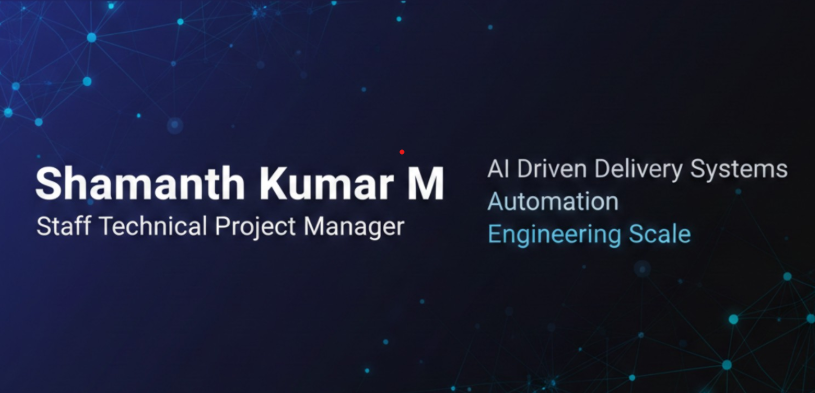

  

# Hi, I'm Shamanth 👋

Staff TPM focused on building AI-driven delivery systems, automation platforms, and scalable engineering execution models.

## 🚀 What I Do
- Design systems that improve engineering productivity and delivery outcomes  
- Build AI-powered tools for planning, estimation, and operational intelligence  
- Lead Agile and DevOps transformation at scale  
- Create practical automation that reduces manual effort and increases decision velocity  

## 🧠 Areas of Interest
AI for engineering productivity  
Technical program leadership  
Delivery intelligence and analytics  
Platform and process automation  
Scalable operating models for engineering teams  

## 🛠️ Technologies & Tools
AI / Automation  
Agile / Scrum / DevOps  
Data-driven delivery systems  
Engineering productivity platforms  

## 🧰 Technology Stack

### 🚀 Agile & Delivery Platforms

  
  
  
  
  
  

### ⚙ Automation & Workflow

  
  
  

### ☁ Engineering & DevOps Foundations

  
  
  
  
  

### 📊 Delivery Intelligence

  
  
  
  

## 📌 Featured Work

🔹 [Personal Portfolio Website (AI-Built)](https://github.com/shamanthmps/shamanth-portfolio)  
AI-assisted personal portfolio showcasing projects, experience, and technical leadership focus.  
🌐 Live site: https://shamanthkm.vercel.app/

🔹 [Sprint Capacity and Execution Tracking System](https://github.com/shamanthmps/sprint_capacity.git)  
AI-built effort estimation and planning intelligence for Jira-based delivery environments. [Private Repo]

🔹 [Impact Log](https://github.com/shamanthmps/impact-log)  
Professional Achievement Tracking and Reflection System.

🔹 [Automation for Operational Efficiency](https://github.com/shamanthmps/work-flows)  
Practical automation tools to reduce manual coordination and improve execution flow.

## 🌐 Connect With Me
Portfolio: https://shamanthkm.vercel.app/  
LinkedIn: https://www.linkedin.com/in/shamanthkumarm/
